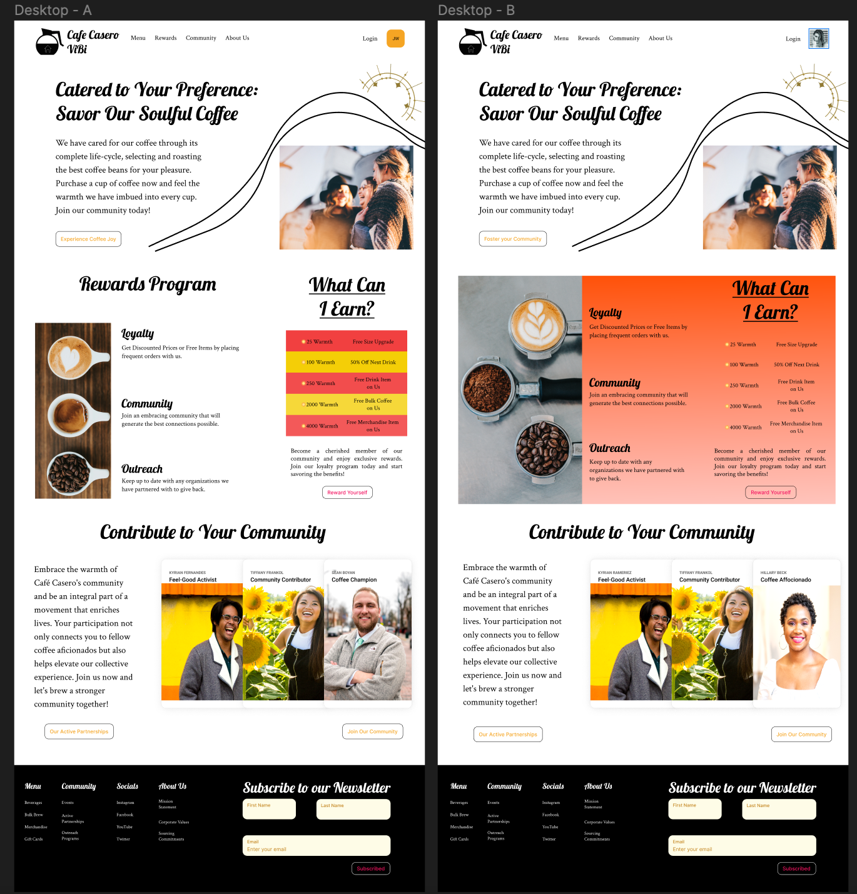

Intro

As our project team iteratively develop this website we will need a design-board that guides us as a frame of reference in which our developer will be able to use to deliver the finalized product. The QA Developer and Designer, was able to create a Figma Design mock-up and presented this design to two different people with different perspectives, knowledge of industry, and personal interests. At the bottom of this document will be an image for reference of what was presented to the two distinct people. Below you will see a brief introduction of their character and how their insights might be valueable and the feedback they provided.

Person 1

Person 1 is a Creative Director at a well known advertisement agency. He has had experience designing websites at the creative level and is sat with tasks to bring new creative ideas to advertisement posts, magazine editions, graphic design or even professional photoshoots. He does not drink coffee and does not particularly identify with the "Caregiver" brand archetype. However, the Figma designer deemed his insight valueable since he has strong creative design principles and can easily identify content placement issues or cohesiveness of content displayed in the design. This is the feedback he gave with the 12/6/23 dated Figma design:
- For the Hero Title and Text make it in-line with the brand logo and image below, so that everything is in one complete line.
- In the Rewards section, align all text so everything is on one line.
- In the Rewards section, he told us to left-align the title "What can I earn?", to make it align with the other content in that section.
- In the Rewards section, he remarked about the color choice of the background color, he gaves us two options. Option 1 is to the change gradient color selection to allow the text to be more reader-friendly. Option 2 was to change the background color to one solid color. 
    - For option 2, he said if the design does end up using the background color of orange and black text that we should bold certain information for readability.
    - Overall, he said to venture out on what is best, so for the next iteration our project team will make sure to do an A/B testing on a different gradient color vs a solid orange background color with bolded text.
- In the Community section, he told us align people's headshots, so that their face is centered in the cards.

Person 2

Person 2 is a undergraduate student focusing in political science. He has had experience working as a barista at one of our potential competitors and strongly identifies with the "caregiver" brand archetype. We deemed his feedback value, since he is a strong power user in how well will our end-users adopt the overall website. This is the feedback he gave with the 12/6/23 dated Figma design:
- Orginally he gave his visual flow feedback as steps he naturally took while viewing the website. The Figma designer extrapolated what was said and noticed that Version B hits key components at the desired sequence of events better than Version A, thus it can be said that Version B flows better than Version A.
- In the feedback, he gave a thoughts and questions section and we noticed that there were alluding questions towards mission values and overall identity questions. The Figma Designer summarized that there should be an about us section that gives a brief overview of what the company is about.
refine community section to better understand what they do and where they located.
- Person 2 noticed that the call-to-action buttons are properly labeled and compels person 2 to want to engage with the content.
- Person 2 glossed over the navigation bar, so in the next iteration we will make the navigation items more prominent for users to identify key sections.

Overall feedback is that - Version B sentiment is higher than Version A.

Screenshot - dated 12/6/23

